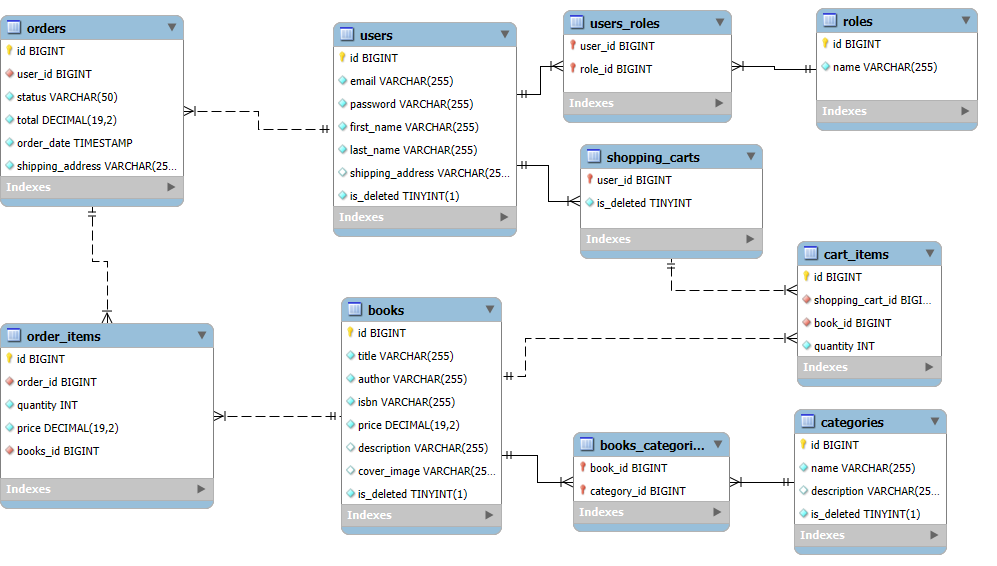

# 📚 BookHub - Online Bookstore API

<div align="center">
  
  
  [](https://openjdk.java.net/projects/jdk/17/)
  [](https://spring.io/projects/spring-boot)
  [](https://www.mysql.com/)
  [](https://www.docker.com/)
  [](https://maven.apache.org/)
  [](LICENSE)
</div>

## 🌟 Overview

BookHub is a modern, RESTful API for an online bookstore built with Spring Boot 3.3.2. It provides comprehensive functionality for managing books, users, orders, and shopping carts with secure JWT authentication and role-based access control. The application follows best practices for enterprise Java development and includes comprehensive testing with TestContainers.

## ✨ Key Features

### 🔐 Security & Authentication
- **JWT-based Authentication** - Secure token-based authentication
- **Role-based Access Control** - Different permissions for users and administrators
- **Password Validation** - Custom validation with field matching
- **Secure Endpoints** - Protected API endpoints based on user roles

### 📚 Book Management
- **CRUD Operations** - Full Create, Read, Update, Delete functionality
- **Advanced Search** - Search books by title, author, price range, and categories
- **Category Organization** - Books organized by categories with many-to-many relationships
- **Image Support** - Book cover images and descriptions

### 🛒 Shopping Experience
- **Shopping Cart** - Add, update, and remove items from cart
- **Order Management** - Create and track orders with status updates
- **Order History** - View past orders and order details
- **Real-time Inventory** - Track book availability

### 🛠️ Technical Features
- **Database Migration** - Liquibase for version-controlled database changes
- **API Documentation** - Interactive Swagger UI documentation
- **Comprehensive Testing** - Unit and integration tests with TestContainers
- **Docker Support** - Complete containerization with Docker Compose
- **Health Monitoring** - Application health checks and monitoring

## 🛠️ Technology Stack

| Category | Technology | Version |
|----------|------------|---------|
| **Language** | Java | 17 |
| **Framework** | Spring Boot | 3.3.2 |
| **Security** | Spring Security + JWT | Latest |
| **Database** | MySQL | 8.0 |
| **ORM** | Hibernate + Spring Data JPA | Latest |
| **Migration** | Liquibase | Latest |
| **Documentation** | SpringDoc OpenAPI (Swagger) | Latest |
| **Mapping** | MapStruct + Lombok | 1.5.5.Final |
| **Testing** | JUnit 5 + TestContainers | 1.20.1 |
| **Build Tool** | Maven | 3.6+ |
| **Containerization** | Docker + Docker Compose | Latest |

## 🗄️ Database Schema

<div align="center">
  
</div>

### Core Entities
- **Users** - User accounts with roles and authentication
- **Books** - Book information with categories and inventory
- **Categories** - Book categorization system
- **Shopping Carts** - User shopping cart management
- **Orders** - Order processing and tracking
- **Order Items** - Individual items within orders

## 🚀 Getting Started

### Prerequisites

- **Java 17** or higher
- **Maven 3.6+**
- **Docker and Docker Compose** (for containerized deployment)
- **MySQL 8.0** (for local development)

### Quick Start with Docker (Recommended)

1. **Clone the repository**
   ```bash
   git clone https://github.com/your-username/BookHub.git
   cd BookHub
   ```

2. **Create environment file**
   ```bash
   cp .env.example .env
   # Edit .env file with your configuration
   ```

3. **Build and run with Docker Compose**
   ```bash
   docker-compose up -d
   ```

4. **Access the application**
   - 🌐 **API Documentation**: http://localhost:8088/swagger-ui/index.html
   - 🔍 **Health Check**: http://localhost:8088/actuator/health
   - 📊 **Application**: http://localhost:8088

### Local Development Setup

1. **Database Setup**
   ```sql
   CREATE DATABASE bookhub;
   CREATE USER 'bookhub_user'@'localhost' IDENTIFIED BY 'your_password';
   GRANT ALL PRIVILEGES ON bookhub.* TO 'bookhub_user'@'localhost';
   FLUSH PRIVILEGES;
   ```

2. **Configure application.properties**
   ```properties
   spring.datasource.url=jdbc:mysql://localhost:3306/bookhub?serverTimezone=UTC
   spring.datasource.username=bookhub_user
   spring.datasource.password=your_password
   ```

3. **Run the application**
   ```bash
   mvn spring-boot:run
   ```

## 🔐 Authentication & Authorization

### Default Accounts

#### Admin Account
- **Email**: admin@example.com
- **Password**: password
- **Role**: ADMIN

#### User Account
- **Email**: user@example.com
- **Password**: password
- **Role**: USER

### Registration Process
1. New users register via `/registration` endpoint
2. Users are automatically assigned the "USER" role
3. JWT token is returned upon successful login
4. Include token in Authorization header: `Bearer <token>`

## 📖 API Documentation

### Base URL
```
http://localhost:8088/api/v1
```

### Authentication Endpoints

| Method | Endpoint | Description | Request Body |
|--------|----------|-------------|--------------|
| `POST` | `/auth/login` | User login | `UserLoginRequestDto` |
| `POST` | `/auth/registration` | User registration | `UserRegistrationRequestDto` |

### Book Management

| Method | Endpoint | Role | Description | Request Body |
|--------|----------|------|-------------|--------------|
| `GET` | `/books` | USER | Get all books (paginated) | - |
| `GET` | `/books/{id}` | USER | Get book by ID | - |
| `GET` | `/books/search` | USER | Search books by parameters | Query params |
| `POST` | `/books` | ADMIN | Create new book | `CreateBookRequestDto` |
| `PUT` | `/books/{id}` | ADMIN | Update book | `BookDto` |
| `DELETE` | `/books/{id}` | ADMIN | Delete book | - |

### Category Management

| Method | Endpoint | Role | Description | Request Body |
|--------|----------|------|-------------|--------------|
| `GET` | `/categories` | USER | Get all categories | - |
| `GET` | `/categories/{id}` | USER | Get category by ID | - |
| `GET` | `/categories/{id}/books` | USER | Get books by category | - |
| `POST` | `/categories` | ADMIN | Create new category | `CreateCategoryRequestDto` |
| `PUT` | `/categories/{id}` | ADMIN | Update category | `CategoryDto` |
| `DELETE` | `/categories/{id}` | ADMIN | Delete category | - |

### Shopping Cart

| Method | Endpoint | Role | Description | Request Body |
|--------|----------|------|-------------|--------------|
| `GET` | `/cart` | USER | Get user's cart | - |
| `POST` | `/cart` | USER | Add item to cart | `CartItemRequestDto` |
| `PUT` | `/cart/{cartItemId}` | USER | Update cart item | `UpdateCartItemRequestDto` |
| `DELETE` | `/cart/{cartItemId}` | USER | Remove item from cart | - |

### Order Management

| Method | Endpoint | Role | Description | Request Body |
|--------|----------|------|-------------|--------------|
| `GET` | `/orders` | USER | Get user's order history | - |
| `POST` | `/orders` | USER | Create new order | `OrderRequestDto` |
| `GET` | `/orders/{orderId}` | USER | Get order details | - |
| `GET` | `/orders/{orderId}/items` | USER | Get order items | - |
| `PATCH` | `/orders/{orderId}` | ADMIN | Update order status | `OrderUpdateRequestDto` |

## 🧪 Testing

### Running Tests

```bash
# Run all tests
mvn test

# Run with coverage report
mvn jacoco:report

# Run integration tests only
mvn verify -Dskip.unit.tests=true

# Run specific test class
mvn test -Dtest=BookControllerTest

# Run tests with debug output
mvn test -Dspring.profiles.active=test
```

### Test Coverage

The project includes comprehensive test coverage:

- **Unit Tests**: Service layer, controllers, and utilities
- **Integration Tests**: Full API endpoint testing with TestContainers
- **Security Tests**: Authentication and authorization testing
- **Database Tests**: Repository layer testing with H2 in-memory database

### Test Data

Test data is automatically loaded via Liquibase changelogs:
- Sample books with categories
- Default users (admin and regular user)
- Sample categories

## 📁 Project Structure

```
src/
├── main/java/online/store/book/
│   ├── config/              # Configuration classes
│   │   ├── MapperConfig.java
│   │   ├── OpenApiConfig.java
│   │   └── SecurityConfig.java
│   ├── controller/          # REST controllers
│   │   ├── AuthenticationController.java
│   │   ├── BookController.java
│   │   ├── CategoryController.java
│   │   ├── OrderController.java
│   │   └── ShoppingCartController.java
│   ├── dto/                # Data Transfer Objects
│   │   ├── book/           # Book-related DTOs
│   │   ├── cart/           # Shopping cart DTOs
│   │   ├── category/       # Category DTOs
│   │   ├── order/          # Order DTOs
│   │   └── user/           # User DTOs
│   ├── exceptions/         # Custom exception handlers
│   ├── mapper/             # MapStruct mappers
│   ├── model/              # Entity models
│   ├── repository/         # Data access layer
│   │   ├── book/           # Book repositories
│   │   ├── cart/           # Shopping cart repositories
│   │   ├── category/       # Category repositories
│   │   ├── order/          # Order repositories
│   │   ├── specification/  # JPA specifications
│   │   └── user/           # User repositories
│   ├── security/           # Security configuration
│   │   ├── AuthenticationService.java
│   │   ├── CustomUserDetailsService.java
│   │   ├── JwtAuthenticationFilter.java
│   │   └── JwtUtil.java
│   ├── service/            # Business logic layer
│   │   ├── book/           # Book services
│   │   ├── cart/           # Shopping cart services
│   │   ├── category/       # Category services
│   │   ├── order/          # Order services
│   │   └── user/           # User services
│   └── validation/         # Custom validators
├── main/resources/
│   ├── db/changelog/       # Liquibase migrations
│   │   └── changes/        # Database change scripts
│   ├── application.properties
│   └── liquibase.properties
└── test/                   # Test classes
    ├── java/
    │   └── online/store/book/
    │       ├── config/     # Test configurations
    │       ├── controller/ # Controller tests
    │       └── service/    # Service tests
    └── resources/
        ├── application.properties
        └── db/             # Test database scripts
```

## 🔧 Configuration

### Environment Variables

Create a `.env` file in the root directory:

```env
# Database Configuration
MYSQLDB_DATABASE=bookhub
MYSQLDB_USER=bookhub_user
MYSQLDB_PASSWORD=your_secure_password
MYSQLDB_LOCAL_PORT=3306
MYSQLDB_DOCKER_PORT=3306

# Application Configuration
SPRING_LOCAL_PORT=8088
SPRING_DOCKER_PORT=8080
DEBUG_PORT=5005

# JWT Configuration
JWT_SECRET=your-super-secret-jwt-key-2024
JWT_EXPIRATION=1200000
```

### Application Properties

Key configuration options in `application.properties`:

```properties
# Database
spring.datasource.url=jdbc:mysql://localhost:3306/bookhub?serverTimezone=UTC
spring.datasource.username=bookhub_user
spring.datasource.password=your_password

# JPA/Hibernate
spring.jpa.hibernate.ddl-auto=validate
spring.jpa.show-sql=true
spring.jpa.open-in-view=false

# JWT
jwt.expiration=1200000
jwt.secret=your-secret-key

# Logging
logging.level.org.springframework.security=DEBUG
logging.level.online.store.book=DEBUG

# Liquibase
spring.liquibase.change-log=classpath:db/changelog/db.changelog-master.yaml
```

### Docker Configuration

The application includes a complete Docker setup:

- **Multi-stage Dockerfile** for optimized builds
- **Docker Compose** for easy deployment
- **Health checks** for both application and database
- **Volume persistence** for database data
- **Network isolation** between services

## 🚀 Deployment

### Production Deployment

1. **Build the application**
   ```bash
   mvn clean package -DskipTests
   ```

2. **Create production environment file**
   ```bash
   cp .env.example .env.prod
   # Configure production settings
   ```

3. **Deploy with Docker Compose**
   ```bash
   docker-compose -f docker-compose.prod.yml up -d
   ```

### Cloud Deployment

The application can be deployed to various cloud platforms:

- **AWS**: Using ECS or EKS
- **Google Cloud**: Using Cloud Run or GKE
- **Azure**: Using Azure Container Instances or AKS
- **Heroku**: Using container deployment

## 🔍 Monitoring & Health Checks

### Health Endpoints

- **Application Health**: `GET /actuator/health`
- **Database Health**: `GET /actuator/health/db`
- **Info**: `GET /actuator/info`

### Logging

The application uses structured logging with different levels:
- **DEBUG**: Detailed debugging information
- **INFO**: General application information
- **WARN**: Warning messages
- **ERROR**: Error messages

## 🤝 Contributing

We welcome contributions! Please follow these steps:

1. **Fork the repository**
2. **Create a feature branch**
   ```bash
   git checkout -b feature/amazing-feature
   ```
3. **Make your changes**
4. **Add tests** for new functionality
5. **Run the test suite**
   ```bash
   mvn test
   ```
6. **Commit your changes**
   ```bash
   git commit -m 'Add amazing feature'
   ```
7. **Push to the branch**
   ```bash
   git push origin feature/amazing-feature
   ```
8. **Open a Pull Request**

### Development Guidelines

- Follow Java coding conventions
- Write comprehensive tests
- Update documentation for new features
- Use meaningful commit messages
- Ensure all tests pass before submitting PR

## 🐛 Troubleshooting

### Common Issues

1. **Database Connection Issues**
   - Verify MySQL is running
   - Check database credentials
   - Ensure database exists

2. **Docker Issues**
   - Check Docker and Docker Compose versions
   - Verify ports are not in use
   - Check container logs: `docker-compose logs`

3. **JWT Token Issues**
   - Verify JWT secret is configured
   - Check token expiration settings
   - Ensure proper Authorization header format

### Getting Help

- Check the [Issues](../../issues) page for known problems
- Review the [API Documentation](http://localhost:8088/swagger-ui/index.html)
- Check application logs for detailed error messages

## 📝 License

This project is licensed under the MIT License - see the [LICENSE](LICENSE) file for details.

## 🙏 Acknowledgments

- **Spring Boot team** for the excellent framework
- **MySQL team** for the reliable database
- **Docker team** for containerization tools
- **TestContainers team** for testing utilities
- **All contributors** who helped improve this project

---

<div align="center">
  <p>Made with ❤️ for the book lovers community</p>
  <p>⭐ Star this repository if you found it helpful!</p>
  <p>📚 Happy reading with BookHub!</p>
</div>
